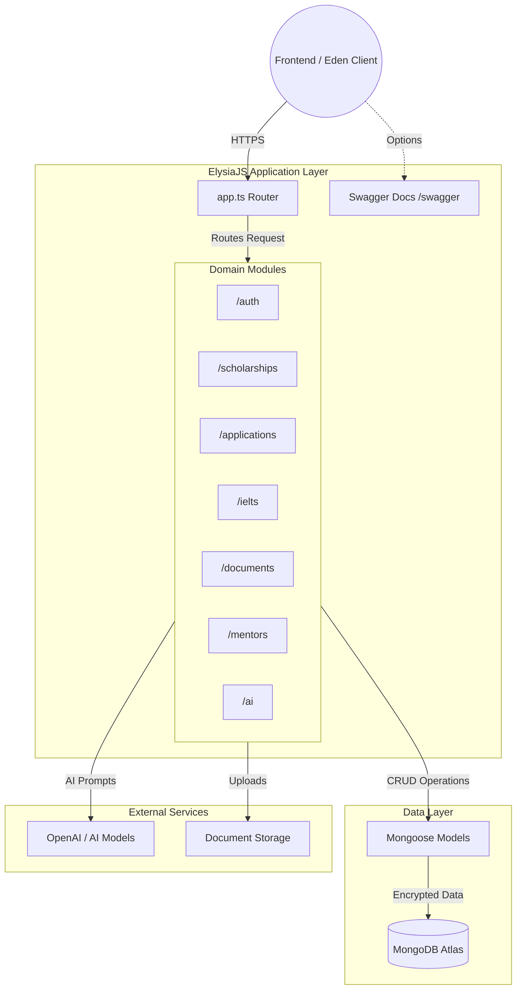

<div  align="center">

# Minerva Backend API

**The robust, high-performance backend API that powers the Minerva platform, handling everything from AI recommendations to secure document storage and user authentication.**

<p>

    

</p>

[Overview](#overview) &nbsp;&bull;&nbsp; [Features](#key-features) &nbsp;&bull;&nbsp; [Demo](#live-demo) &nbsp;&bull;&nbsp; [Installation](#installation) &nbsp;&bull;&nbsp; [API Docs](#api-documentation)

</div>

<hr/>

##  Table of Contents

- [Overview](#overview)

- [The Problem](#the-problem)

- [Our Solution](#our-solution)

- [Key Features](#key-features)

- [Live Demo](#live-demo)

- [Tech Stack](#tech-stack)

- [Architecture](#architecture)

- [Installation](#installation)

- [API Documentation](#api-documentation)

- [Deployment](#deployment)

- [Team](#team)

- [Acknowledgments](#acknowledgments)

- [Contact & Support](#contact--support)

- [Project Status](#project-status)

<hr/>

##  Overview

Minerva Backend is a high-performance RESTful API built on top of Bun and ElysiaJS. It serves as the data and business logic foundation for the Minerva ecosystem, orchestrating complex workflows such as AI-driven document reviews, IELTS test evaluations, secure user authentication, and comprehensive scholarship data management.

<hr/>

##  The Problem

Students often use multiple websites and services to search for scholarships, review application documents, prepare for language tests, and find mentors. This creates several problems:

- Scholarship information is scattered across different platforms.

- Students don’t know which scholarships match their profiles.

- Scholarship requirements may be difficult to understand.

- Documents may not meet scholarship standards.

- Scholarship time-window may be difficult to track.

- Students have limited access to interview and test preparation.

<hr/>

##  Our Solution

Minerva's backend replaces fragmented systems by providing a centralized, extremely fast API layer. Designed with a modular architecture, it bridges frontend requests with a secure MongoDB data store. Utilizing ElysiaJS ensures end-to-end type safety, while our integration with advanced AI models allows for real-time essay analysis and test preparation feedback. Every endpoint is thoroughly documented via an auto-generated Swagger interface.

<hr/>

##  Key Features

Based on the implemented modules and core capabilities, the backend offers the following features:

### Core Architecture & Security

- **Field-Level Encryption (FLE)**: Sensitive user data (like phone numbers) is securely encrypted at rest within MongoDB.

- **Modular Domain-Driven Design**: Logic is strictly separated into distinct modules (e.g., `/auth`, `/applications`, `/ielts`) for maintainability.

### AI & Integrations

- **Document Processing**: Built-in parsers (using Mammoth) to extract and evaluate text from uploaded resumes and essays.

- **Automated Evaluations**: Endpoints dedicated to processing mock IELTS speaking and writing submissions through advanced LLMs.

### Developer Experience

- **Auto-generated Swagger Docs**: Explore and test all endpoints dynamically via the `/swagger` UI.

- **Elysia Eden Ready**: Exposes strict TypeBox schemas allowing the frontend to consume the API with zero-friction type safety.

<hr/>

##  Live Demo

### 🔗 Access Minerva Backend

- **Production API URL**: [https://api.minerva.ac.id/](https://api.minerva.ac.id/)

- **Swagger Docs**: [https://api.minerva.ac.id/swagger](https://api.minerva.ac.id/swagger)

<hr/>

##  Tech Stack

The backend application is built on a modern, high-performance web stack:

### Core Framework & Runtime

- **Runtime**: Bun (v1.3+)

- **Framework**: ElysiaJS

- **Language**: TypeScript strict mode

### Database & ORM

- **Database**: MongoDB Atlas

- **ORM**: Mongoose (with custom encryption hooks)

### Tooling & Utilities

- **API Documentation**: @elysiajs/swagger

- **Document Parsing**: mammoth

- **Testing**: bun test

<hr/>

##  Architecture

The diagram below outlines the core backend request lifecycle and modular structure:



<hr/>

##  Installation

Follow these steps to set up the development environment locally:

1.  **Clone the repository:**

```bash


git  clone  https://github.com/YangHansen/project-minerva-be.git


cd  project-minerva-be


```

2.  **Configure Environment Variables:**

Copy the example environment file and configure it. Ensure `MONGODB_URI` and `SESSION_SECRET` are set.

```bash


cp  .env.example  .env


```

3.  **Install Dependencies:**

The project utilizes Bun as its package manager.

```bash


bun  install


```

4.  **Start the Development Server:**

```bash


bun  run  dev


```

The application will be available at `http://localhost:3000`.

<hr/>

##  API Documentation

The backend automatically generates interactive OpenAPI documentation using the `@elysiajs/swagger` plugin.

- **Swagger UI**: Accessible by navigating to `http://localhost:3000/swagger` while the development server is running. This provides a dynamic interface to test endpoints and view schemas.

- **Eden Treaty**: By leveraging Elysia's TypeBox integration, the backend securely exports end-to-end type definitions, which the Minerva frontend consumes directly without writing manual fetch calls.

<hr/>

##  Deployment

The backend application is containerized and hosted securely on **Render**.

- **Hosting & CI/CD:** Deployed as a web service via Docker, automatically building and launching upon successful merges to the main branch.

- **Database:** Connects to a dedicated MongoDB Atlas cluster tailored for high-availability and encrypted data storage.

_(Note: The companion frontend application is hosted independently on Cloudflare Pages.)_

<hr/>

##  Team

**Minerva** is developed by **HERMES Team** as part of our capstone project.

<table>
  <tr>
    <td align="center">
      <br/>
      <b>Bridget Beatrix Claire</b><br/>
      <a href="https://linkedin.com/in/bridget-claire">
        
      </a><br/>
    </td>
    <td align="center">
      <br/>
      <b>Hansen</b><br/>
      <a href="https://linkedin.com/in/Hansen">
        
      </a><br/>
    </td>
    <td align="center">
      <br/>
      <b>Mutya Qurratu'ayuni Mustafa</b><br/>
      <a href="https://linkedin.com/in/Mutya-Qurratuayuni-Mustafa">
        
      </a><br/>
    </td>
  </tr>
  <tr>
    <td align="center">
      <br/>
      <b>Syafira Al Atika</b><br/>
      <a href="https://linkedin.com/in/Syafira-Al-Atika">
        
      </a><br/>
    </td>
    <td align="center">
      <br/>
      <b>Tsabitah Dinniyah</b><br/>
      <a href="https://linkedin.com/in/tsabitahdinniyah">
        
      </a><br/>
    </td>
    </td>
    <td align="center">
            <br/>
      <b>Yusril Zubaydi</b><br/>
      <a href="https://linkedin.com/in/yusril-zubaydi">
        
      </a><br/>
    </td>
  </tr>
</table>

<hr/>

##  Acknowledgments

- **Sustainable Development Goals (SDG 4)** for inspiring our mission

- **OpenAI** for embedding models

- **MongoDB Atlas** for database hosting

- **All open-source contributors** whose libraries made this possible

<hr/>

##  Contact & Support

**Email**: minerva.ai@keemail.me

<hr/>

##  Project Status

**Current Version**: 1.0.0 (MVP Ready)

**Roadmap**:

- [x] **Phase 1: Core Architecture & Data** (Authentication, Normalized Scholarship Database)

- [x] **Phase 2: Intelligent Discovery** (AI Recommendations, Search & Filtering)

- [x] **Phase 3: Unified Workspace** (Checklist Tracker & Document Management Bridge)

- [x] **Phase 4: Preparation & Mentorship** (AI CV/Essay Reviews, IELTS Simulations, Mentor Booking)

- [x] **Phase 5: MVP Deployment** (Cloudflare & Render Infrastructure)

- [ ] **Phase 6: Advanced Ecosystem** (Real Payment Processing, Direct University Portal Integrations)

- [ ] **Phase 7: Global Scaling** (Advanced AI Model Training, Full Multilingual Support)
